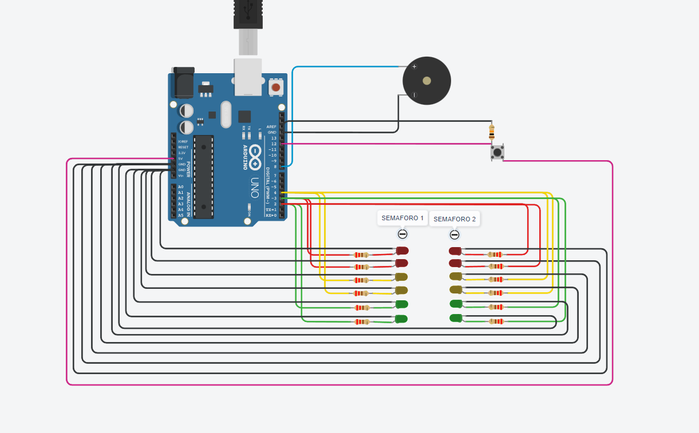

# 🧑‍💻 DOJO - H 

###  1 - LA PRIMER  ENTREGA SERÁ LO SIGUIENTE: 
- 1- El semáforo tiene que tener 2 leds de cada color como mínimo, en caso de que uno se  rompa. 
- 2- Tiene que implementar los tiempos correctos como se detallan a continuación.  
- 3- El verde dura 5 segundos. 
- 4- El amarillo dura 3 segundos. 
- 5- Rojo dura 5 segundos. 
- 6- Tiene que tener señalización para personas no videntes como se detalla a  continuación. (Buzzer o piezo)
- 7- Durante el rojo: Tiene que sonar 2 vez por segundo en un tono FUERTE. 

### 2 - LA SEGUNDA ENTREGA AGREGA LO SIGUIENTE EN UN NUEVO PROYECTO, 
- 8-  Durante el amarillo: Tiene que sonar 1 vez por segundo en un tono SUAVE. 
- 9- Al cambiar de verde a amarillo debe titilar 3 veces el verde antes de pasar al amarillo
- 10- Al cambiar de amarillo a rojo se debe titilar 3 veces el amarillo
- 11- Al cambiar de rojo a Amarillo se debe titilar 3 veces el rojo
- 12- Al cambiar de amarillo a verde se debe titilar 3 veces el amarillo.

### 3 - LA TERCER ENTREGA AGREGA LO SIGUIENTE EN UN NUEVO PROYECTO, 
- 13-  Agregar un botón (pull down) que al presionarlo se active la funcionalidad de luz verde con más tiempo, dándole a la persona que lo necesite más tiempo para cruzar la calle , sirve para la próxima luz verde y solo para la próxima luz verde después de presionar el botón. el tiempo se duplicará. 
- 14-  Colocar dos semáforos de calles que se crucen  y programarlos para que funcionen en conjunto.

### PREVIEW DEL PROYETO 👀 ##
  

### INTEGRANTES Y LOS VINCULOS A SUS PROYECTOS ##

- [Gilberto Martin](https://www.tinkercad.com/things/5pXlpV816XZ-dojo3/editel?sharecode=yCpDAnZUm712vBE0kDd0Rz_WYOk88GDM2wGPkbb9ZIs)
- [Gabriel Fernandez Waisberg](https://www.tinkercad.com/things/0RdaOw0HQTC-copy-of-dojo-2/editel?sharecode=ZxHEl9Q67c_hKG1IlrNU0bPgRVn28OKnEZZbxegi25g)
- Efren David
- [Alejo Falcone](https://www.tinkercad.com/things/9bwCCOMuFfW)
- [Ignacio Fadon](https://www.tinkercad.com/things/2p5GQIGUFUP-copy-of-dojo-1/editel?sharecode=G9psCEdKSoA4qK60wavToCPAxX4I_tY_HHd9OPQHZhA )

